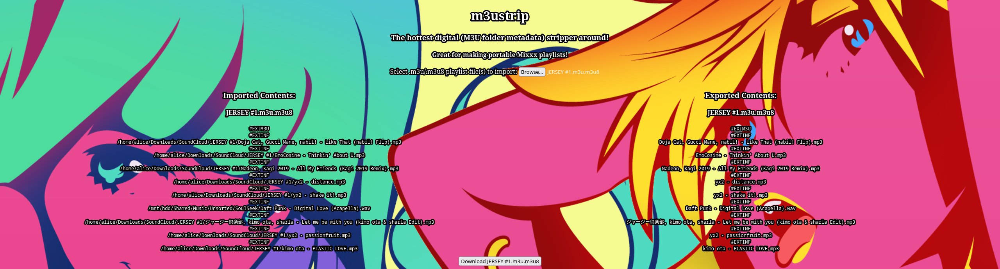

# MixxxUtilities
Various scripts and programs for simplifying one's workflow in Mixxx. 

## [MIDIScanner](https://github.com/faithvoid/MIDIScanner)

A terminal program that shows CC/Note/Channel/Value input information for MIDI controllers, useful for mapping out MIDI devices for controller scripts. Works on Linux and macOS but should also compile on Windows, and can be run in the background at the same time as another application using the same selected MIDI controller (such as Mixxx). 

### Why(?)
Manually mapping out values by hand or via --controller-debug in Mixxx has been a NIGHTMARE for me, so I made this small program to leave running in the background while I map controls and work on their respective scripts. You'll need to convert the values to hexadecimal, but the MIDI mapping guide on Mixxx explains exactly how to do that!

## [m3ustrip](https://virtual.dimensionless.space/dj/m3ustrip)

HTML script that removes all folder information from .m3u/.m3u8 files. Useful for carrying your sets (including hotcues, BPM, etc) on a USB if you combine it with the "Write Serato Metadata" function in Mixxx, as importing them without folder data will have the playlist default to the same folder the playlist file is in. 

### Why(?)
My use case for this is I keep all my Mixxx sets in subfolders in a folder labelled "Mixxx" on my USB drive. I'll export my a new set into a new folder in the "Mixxx" set folder, import it into m3ustrip, export the result in the "Mixxx" set folder, and then my set is ready to be imported into another installation of Mixxx on a seperate computer from any directory (either directly from the USB or any folder on the new system)!

## setlistbackup.py - Back up your setlist information into a convenient spreadsheet!
Generates an .XLS spreadsheet file inside all subfolders the script is run in, which backs up ID3 metadata of artists/songs/albums and genres contained in the subfolder. Useful for backing up metadata to the cloud in case of data loss. Requires files to have proper ID3 metadata (but if you're a DJ you should be making sure of this anyway). Also this script isn't Mixxx-specific so use it on your DJ crates and playlists so you don't lose your track info! Requires python-eyed3 & python-xlwt.

### Why(?)
I was mainly looking for a quick and simple solution to backing up crate information in the event of catastrophic data failure. By converting it to an .XLS spreadsheet, it's simple to back up onto a cloud drive and read from, with the ability to organize by genre/artist/etc. in any spreadsheet software. 

### TODO:
Change from proprietary .XLS exporting to the open-source .ODS formatting.
